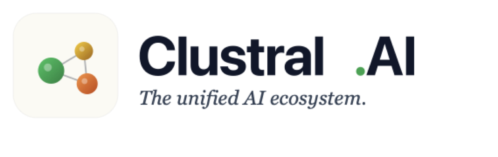

# Lifecycle Hub

**Water main failure intelligence. A [Clustral AI](https://clustralai.com) product.**

**What was the system trying to tell us before it broke?**

Water mains rarely fail without warning. The warning is just fragmented — spread
across telemetry, weather, inspection PDFs, work orders, customer complaints and
public notices, none of which is decisive on its own. Lifecycle Hub connects those
fragments into a temporal evidence graph, detects when weak signals begin
converging on one asset, explains why in language an operator can audit, and
reconstructs what was knowable before a failure.

> **Decision support — not an autonomous control system.** Lifecycle Hub recommends
> inspection. It does not authorise excavation and issues no operational control.

---

## The honest part first

Everything here runs on a **simulated** network. That is a deliberate choice —
utility telemetry is not obtainable in a hackathon — and it is stated everywhere
the data renders. Two things make the simulation more than set dressing:

**The engine cannot see the answer.** Each asset carries a latent condition that
degrades under a runaway regime; failures are drawn from a hazard function of
it. Telemetry is a *noisy, partial observation* — 40% of segments have no sensor
at all. Ground truth lives in `_ground-truth.json`, which only the backtest may
open. If the engine could read it, the backtest would be scoring it on
recovering a signal it had been handed.

**The simulation is validated, not asserted.** `npm run validate` checks 19
properties against NOAA Pittsburgh normals and AWWA break statistics — annual
precipitation, freeze-thaw days, break rate per 100 miles, winter:summer
seasonality, cast-iron share of breaks, and the detectability of the precursor
itself. It fails loudly.

The geography is real. Street names, neighbourhoods and PWSA pressure-zone names
are genuine Pittsburgh references, because the external-context layer searches
the live web and needs real place names to find real municipal information. The
pipes, sensors, telemetry, failures and inspection reports are all generated.

---

## Results

Walk-forward backtest, 51 evaluation dates, predicting failure within 90 days,
against the two prioritisation methods utilities actually use today.

| | PR-AUC | vs random | Precision@10 | Recall@50 |
|---|---|---|---|---|
| Pipe age | 0.0123 | 2.3× | 1.6% | 7.9% |
| Age + break history | 0.0106 | 2.0× | 0.0% | 1.5% |
| **Lifecycle Hub** | **0.0901** | **16.7×** | **18.4%** | **37.4%** |

**Median warning lead time: 130 days** (IQR 75–186). Only **29%** of failures
cross the actionable band — the other 71% get no warning. Calibration is
monotonic: the 65–79 band shows a 26.5% observed 90-day failure rate; 0–19 shows
0.00%.

A **truncation test** proves as-of discipline: physically deleting every record
after the scoring date changes no score, across 7,172 asset-date evaluations.
Leakage is invisible in output — it just makes a model look good — so it is
proved rather than asserted.

---

## How the score works

Six evidence families, each capped at its own weight so eight weak hydraulic
blips can never outvote a severe corrosion finding:

| Family | Max | What it carries |
|---|---|---|
| Asset history | 26 | Age, material, prior breaks, repair burden |
| Hydraulic | 24 | Pressure variance and regime change, **normalised against zone peers** |
| Spatial | 18 | Nearby breaks weighted by distance and recency; complaint clusters |
| Environmental | 14 | Freeze-thaw loading, soil-moisture swing, by material sensitivity |
| Documentary | 14 | Inspection findings, decayed by age |
| External | 6 | Live public context, corroboration required |

Plus a **convergence bonus** (max 12) when three or more independent families
agree — the product thesis in one term.

**Zone normalisation is the load-bearing idea.** Pump changeovers and seasonal
demand move every asset in a pressure zone together, and a naive detector reads
that as hundreds of simultaneous pipe anomalies. Hydraulic evidence here is
always relative to the asset's own zone peers on the same day, so what surfaces
is divergence, not weather.

Every point is attributable to a named factor with a stated provenance —
`observed`, `inferred`, `predicted` or `recommended` — because an operator who
cannot see why will not dig up a street.

---

## Design language

The interface uses the Clustral AI palette — the green, yellow and orange of the
logo mark's node graph, slate text, and the `#e5e7eb` hairline from
clustralai.com. Light is the default because that is the brand's default; a dark
theme is one toggle away because control rooms are dim.

The risk ramp is drawn entirely from the logo's own gradient stops, which means
it runs green-to-red. That is a real accessibility cost — roughly 8% of men have
a red-green deficiency — so colour is never the sole carrier: the numeric score
and the band label (`MINIMAL` … `CRITICAL`) appear wherever the colour does, and
stroke weight independently encodes diameter.

## Architecture

```
                       Operator console (Next.js)
                                  │
              ┌───────────────────┼───────────────────┐
              ▼                   ▼                   ▼
      Lifecycle Hub risk     Xano backend        Live retrieval
           engine         (system of record)   SerpApi · Querit
              │                   │                   │
              ▼                   ▼                   ▼
     Azure Data Explorer    assets · snapshots   Nutrient DWS
      telemetry · KQL       factors · evidence   PDF → structured
     Azure Digital Twins    recommendations      evidence
      asset relationships   audit trail
```

The split is deliberate. **Azure** carries analytics — high-volume time series
and KQL feature extraction. **Xano** carries the application system of record —
which asset was flagged, on what evidence, what was recommended, who approved
it. Pushing a million telemetry rows a day through the application backend would
be the wrong architecture wearing the right logo.

### Sponsor integrations

| Service | Role | State |
|---|---|---|
| **Azure** | ADX: 414,275 telemetry rows + KQL. Blob staging. gpt-5-mini. | Live |
| **Azure Digital Twins** | Asset relationship graph (DTDL models written) | Needs a data-plane role grant — see below |
| **Xano** | Backend of record: 7 tables provisioned as code, 120 assets synced | Live |
| **SerpApi** | Live corridor context — breaks, construction, municipal notices | Live |
| **Querit** | Durable failure-mechanism research | Live |
| **Nutrient DWS** | Inspection PDF → structured evidence, accuracy measured | Live |
| **Doctavian** | Intended report renderer | Credential rejected — see below |

**Azure Digital Twins**: the instance is provisioned and `npm run azure:twins`
builds the full graph, but Digital Twins data-plane access is a separate RBAC
role that subscription ownership does not confer. Grant it once:

```bash
az dt role-assignment create --dt-name clustral-water-twins -g clustral-rg \
  --assignee infra@clustralai.com --role "Azure Digital Twins Data Owner"
```

**Doctavian**: its generate endpoint requires a pre-uploaded DOCX template and
two encrypted AES JWTs; the supplied key returns `ApiKeyNotFound` on every
header scheme. The report feature is built and works — rendering sits behind an
interface and currently runs through Nutrient. The PDF footer and response
headers state which renderer ran and why. Swap the credential and it moves over.

---

## Running it

```bash
npm install
npm run generate      # build and validate the synthetic network
npm run validate      # 19 checks against NOAA / AWWA benchmarks
npm run backtest      # walk-forward evaluation vs baselines
npm run test:leakage  # prove as-of discipline
npm run precompute    # map payload
npx next dev --webpack -p 3100
```

Integrations need `.env.local` (copy `.env.example`). Xano authenticates from
the CLI (`xano auth`) — no token is pasted or committed. Azure uses `az login`.

```bash
npm run xano:provision   # create tables
npm run xano:sync        # publish current assessment
npm run nutrient -- 14   # document pipeline + accuracy report
npm run azure:ingest     # stage to blob, ingest to ADX, run KQL
```

---

## Where it goes

Stage 1 is this: synthetic plus public data. Stage 2 is one utility pilot —
connect GIS, CMMS, SCADA, pressure loggers and work orders, and recalibrate the
hazard against that utility's own break history. The engine is deliberately
rule-based and decomposable at this stage; a model nobody can interrogate is not
deployable against a decision to excavate a street.

## What is not built

No custom hardware, no SCADA replacement, no GIS editor, no autonomous valve
control, no GPU training. The prototype is an intelligence layer, not a platform.
